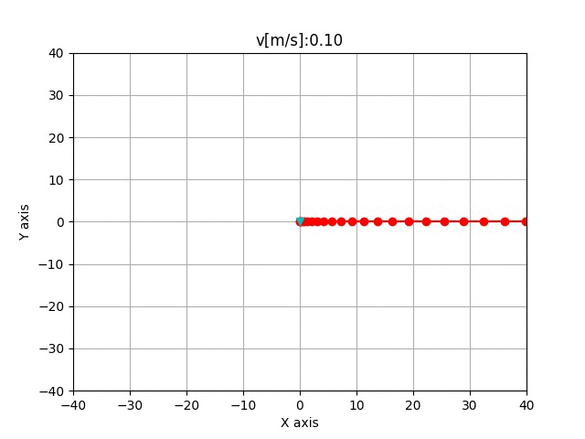
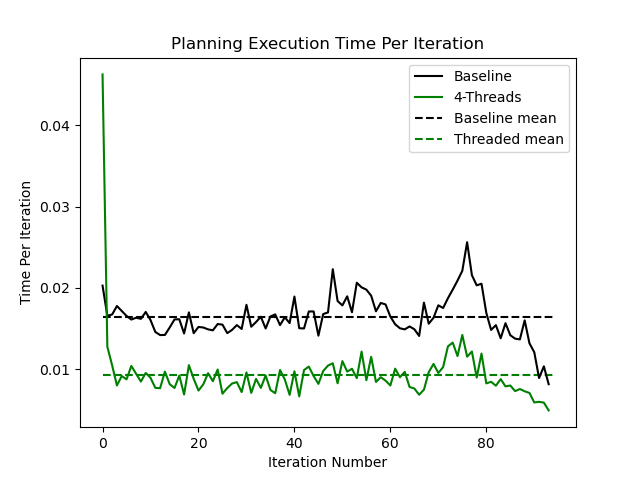
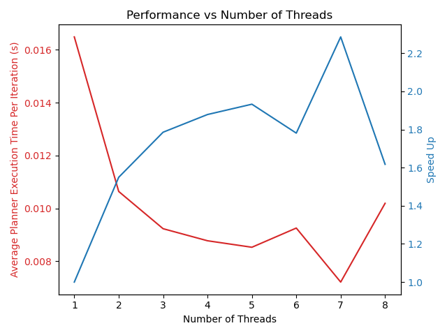

# Frenet Optimal Trajectory



## Overview
This repository contains a fast, C++ implementation of the Frenet Optimal
 Trajectory algorithm with a Python wrapper. It is used as one of the motion planning models in 
 [pylot](https://github.com/erdos-project/pylot), an [erdos](https://github.com/erdos-project) project.
 
Reference Papers:
- [Optimal Trajectory Generation for Dynamic Street Scenarios in a Frenet Frame](https://www.researchgate.net/profile/Moritz_Werling/publication/224156269_Optimal_Trajectory_Generation_for_Dynamic_Street_Scenarios_in_a_Frenet_Frame/links/54f749df0cf210398e9277af.pdf)
- [Optimal trajectory generation for dynamic street scenarios in a Frenet Frame](https://www.youtube.com/watch?v=Cj6tAQe7UCY)

## Profiling
Some basic profiling of the code (same trajectory as demo, 10 obstacles) 
indicates the following expected performance:
```
Average Time: ~7 ms
Max Time: ~20 ms
```

## Setup
```
git clone https://github.com/fangedward/frenet-optimal-trajectory-planner.git
./build.sh
```

## Example Usage
There is a Python wrapper and C++ API. The Python wrapper is located in 
`FrenetOptimalTrajectory/fot_wrapper.py` and the C++ API is under 
`src/FrenetOptimalTrajectory/fot_wrapper.cpp`.
The following command will simulate a simple scenario to run the
 FrenetOptimalTrajectory planning algorithm.

Use `fot.py` to run the FrenetOptimalTrajectory planning algorithm.

```
python3 FrenetOptimalTrajectory/fot.py
```

Here are some flags you can pass in:
* `-d`, `--display`, display animation. Ensure you have X11 forwarding enabled if running on a server.
* `-v`, `--verbose`, prints detailed states one each iteration.
* `-s`, `--save`, screenshot each frame and save to `/img/frames`; you can use them to make `.gif`.
* `-t`, `--thread`, set number of threads. Default will be 0 (no threading). Accepts positive integer arguments.


Use `fot_profile.py` to measure multi-threading speedup of the FrenetOptimalTrajectory planning algorithm.
To measure speed up with threading:
```
python3 FrenetOptimalTrajectory/fot_profile.py -t 4 -p -c
```

Here are some additional flags you can pass in, on top of the 4 flags listed above:
* `-c`, `--compare`, compare threaded program with unthreaded baseline for time profiling.
* `-p`, `--profile`, show a plot of runtime profile across iterations.
* `-f`, `--full`, generate comparisons of runtime and speed up ratio across running planner on different number of threads.


Besides using command line input, you can specify number of threads by going to `fot.py` and editing `num_threads` under `hyperparameters`. To use the non-threaded implementation of the algorithm, set `num_threads` to `0`.

### Speed Up Performance

The above flags are mostly used to visualize the effect of threading. To enable threading, pass in `-t NUM_THREADS` and specify the number of threads you want to use. 

Use the `-c` flag to see a speedup comparison between the threaded version and the baseline non-threaded runtime. The `-p` flag gives you a graph of planner runtime across iterations. Below shows an example of comparing runtime per iteration across iterations for using 4 threads vs a single thread.



To see the performance across using different number of threads, you can use the `-f` flag. Below shows a comparison of Runtime & Speedup using different number of threads, profiled on a 4-Core CPU with 8 logical processors.




## Anytime Planner
This project also contains an Anytime implementation of the Frenet Optimal Trajectory planner. 

You can read more about Anytime Algorithms at:
* Zilberstein, S. 1996. Using Anytime Algorithms in Intelligent Systems. AI Magazine. 17, 3 (Mar. 1996), 73. DOI:https://doi.org/10.1609/aimag.v17i3.1232.

The Anytime FOT Planner differs from the regular planner in that the planner will immediately return with an available path when queried. The regular planner exhaustively searches through all possible paths to return a result (which is the best path among all the paths it found). In contrast, the anytime planner immediately returns the best path found so far. In a time-constrained setting, this allows to quickly use a slightly proceed with a feasible plan, rather than waiting for planner to search through possibilities to find the best plan.

The Anytime Planner is monotonic in path quality, meaning that the quality of the returned path does not get worse with time. In this case, the cost of the paths only decreases or stays the same every time the planner is queried.

The Anytime version of the planner can be found in `src/FrenetOptimalTrajectory/AnytimeFrenetOptimalTrajectory.cpp`. This builds on the multi-threaded implementation of the planner. The planner launches a thread pool to start planning (each searching a part of state space), and is able to return the current best path when queried. `./build/AnytimeFrenetOptimalTrajectoryTest` contains a unit test to verify the C++ logic and the monotonicity property.

To use the Anytime planner in Python, we have created a python package called `fot_planner` which can be installed with `./install.sh`. Make sure to upgrade your gcc and g++ version to g++-9. Modify the library include path to dependencies in `setup.py` if needed. See `src/FrenetOptimalTrajectory/planner_package.cpp` on how we extended Python with C++.

To run the python example, execute `python FrenetOptimalTrajectory/anytime_test.py`.
